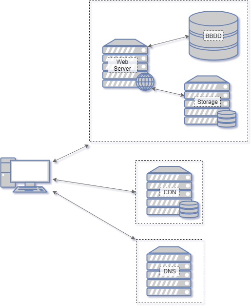
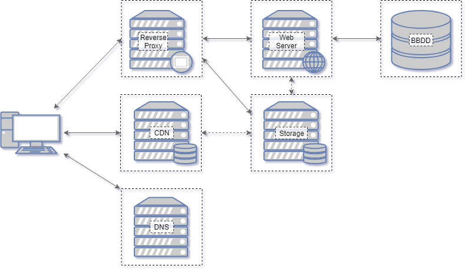
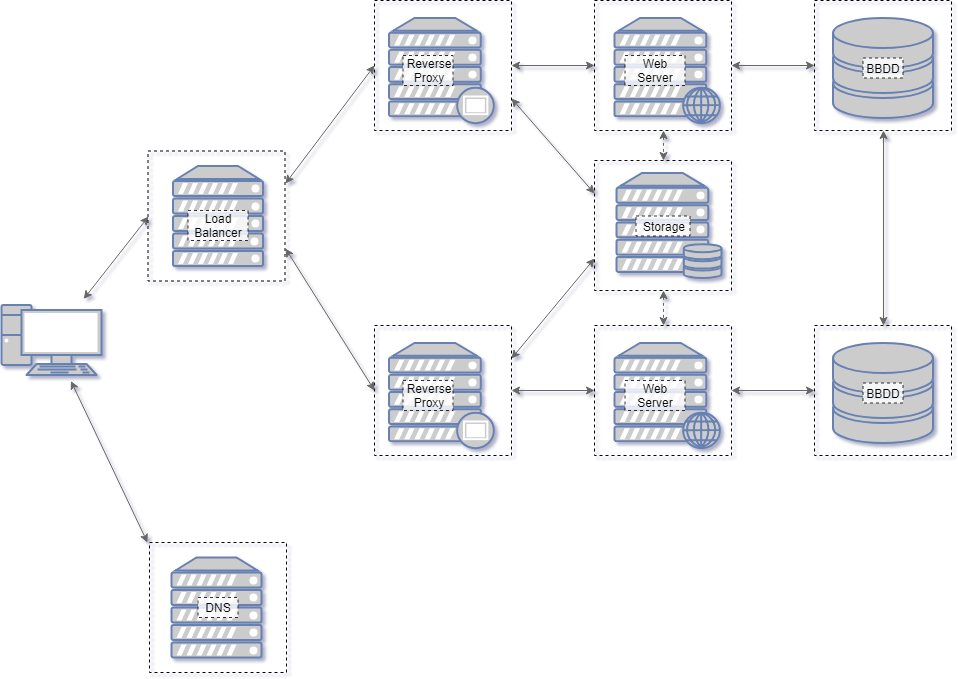

La arquitectura de un sitio web o aplicación web es la descripción de la configuración, función y relación de los distintos componentes que la integran. En este artículo me voy a centrar en dar un vistazo general de la arquitectura del hardware subyacente sobre el que corre un sitio web.

## En el principio...

Cuando comenzamos con nuestro sitio lo más probable que nuestra arquitectura se limite a un único servidor donde están los tres componentes más comunes: el servidor web, la base de datos y el almacenamiento. Además de esto nos apoyaremos en un servidor DNS, generalmente manejado por nuestro proveedor de hosting, y en un CDN para servir las librerías y/o el framework que utilicemos.

### Servidor web

Es el encargado de recibir y responder las peticiones HTTP del navegador de los usuarios. En lo básico su funcionamiento se limita a recibir un pedido de una url, buscar el archivo correspondiente en el sistema de archivos y enviarlo. Este funcionamiento se puede ampliar mediante módulos o extensiones como PHP que le permite "ejecutar" los archivos escritos en ese lenguaje antes de enviar la respuesta al cliente. [Apache httpd](http://httpd.apache.org), [NGINX](https://nginx.org/) y [Microsoft IIS](https://www.iis.net/) son los [tres más usados](https://w3techs.com/technologies/overview/web_server/all).

### Base de datos

Toda aquella información que no guardamos en archivos y no tomamos de otros servicios normalmente termina almacenado de una forma sistematizada en la base de datos. Las ventajas derivadas de tener la información en una BBDD viene dada por la especialización de las mismas que permiten la realización de consultas mucho más complejas y más rápido que con otros sistemas de almacenamiento. [Oracle Database](https://www.oracle.com/database/technologies/index.html), [MySQL](https://www.mysql.com/) y [Microsoft SQL Server](https://www.microsoft.com/es-es/sql-server/sql-server-2017) son las [tres más usadas](https://db-engines.com/en/ranking).

### Almacenamiento

Imágenes, audio, código fuente, étc, todo tiene que estar guardado en algún lugar accesible para el servidor web. A los efectos prácticos es donde va a parar todo aquello que por su tamaño u otras razones no podemos almacenar en nuestra base de datos. Dependiendo de nuestras necesidades puede ser el mismo sistema de archivos del sistema operativo o algún sistema por bloques u objetos más especializado.

### CDN

Aunque está representado únicamente por un servidor es, en realidad, una red de servidores que proveen almacenamiento distribuido en muchos puntos del planeta. La idea detrás de este servicio es reducir la distancia entre el usuario y los archivos proveyendo una copia de los mismos en un punto de la red más cercano físicamente. Esto permite liberar parte de la carga de nuestro servidor y mejorar los tiempos de acceso a la información. Algunos de los más conocidos son [Akamai](https://www.akamai.com/es/es/), [MaxCDN,](https://www.stackpath.com/maxcdn/) [Amazon AWS](https://aws.amazon.com/es/) y [Cloudflare](https://www.cloudflare.com/es-es/).

## Más potencia...

A medida que la cantidad de usuarios que acceden a nuestro sitio web comienza a aumentar los recursos de nuestra aplicación se van a ver excedidos. Esta falta de recursos suele identificarse en alguno de estos cuatro puntos:

- CPU
- Memoria
- E/S de red
- E/S de disco

En líneas generales, dejando de lado los problemas de código, nuestros problemas se van a centrar en CPU y memoria. Tanto nuestro servidor web como nuestra base de datos compiten por estos recursos y cuando se agotan es cuando suelen comenzar a aparecer las desconexiones intermitentes, falsos 404 y caídas.

La solución obvia pasa por el escalamiento vertical, es decir, mover el sitio a un servidor más potente. Durante un tiempo esto nos va a permitir seguir trabajando pero en algún momento vamos a encontrarnos con un techo y vamos a necesitar una nueva solución.

Esta solución consisten en utilizar servidores específicos para cada componente del sitio web. Ahora ya no compiten entre si sino que tienen recursos dedicados.

### Reverse Proxy

Un servidor proxy funciona como intermediario entre los dos extremos de una conexión permitiendo hacer cambios en el contenido como el destino de la comunicación de forma transparente para ambos terminales. En lo que a nuestro sitio respecta, su funcionalidad pasa por recibir todos los pedidos de los clientes y redirigirlos al servidor apropiado. En el gráfico se utiliza para separar el contenido estático de la aplicación propiamente dicha.

### CDN

Si tenemos una gran cantidad de archivos estáticos o son de un gran tamaño también puede ser momento de empezar a utilizar la CDN también para nuestros contenidos. Cada servicio tiene sus particularidades pero en general esta distribución de contenido se dará mediante push o pull. El primer caso es la carga activa de nuestros contenidos en la CDN, utilizamos la red para aquellos contenidos que específicamente  subamos. El otro método implica que la CDN funcione como intermediaria con nuestro sitio web y la primera vez que un usuario solicite un contenido lo cargue de forma automática.

## No hay dos sin tres...

Al igual que la primera solución, la anterior, también puede verse superada y, nuevamente, nos encontraremos en la necesidad de agregar más servidores pero ¿dónde? Cada parte de nuestro sitio está en su propio servidor y no podemos subdividirlo en componentes más pequeños por lo que ahora tendremos que empezar a duplicarlo. Si tenemos dos servidores web en vez de uno deberíamos duplicar nuestra capacidad, ídem con la BBDD. 

La duplicación de los distintos módulos trae, igualmente, nuevos problemas asociados: como distribuir los pedidos de los usuarios entre uno y otro y cómo mantenerlos sincronizados para que den la misma respuesta.

### Load Balancer

Para solucionar el primer problema entra en el juego los balanceadores de carga cuya función específica es decidir a que nodo enviar la petición recibida. Dependiendo de la implementación que utilicemos además tendremos la posibilidad de desviar a el contenido a otro servidor si uno se cae, persistir las sesiones mandando todas las peticiones de un usuario al mismo servidor, étc.

### Replicación de la BBDD

Mantener sincronizadas distintas base de datos es un problema bastante complejo pero, por suerte, en lo que respecta a nuestro sitio web, los distintos DBMS traen sistemas que se encargan de hacerlo con unas pocas líneas de configuración de nuestra parte.

En líneas generales la idea detrás de la replicación es la existencia una base de datos original que, cada vez que se modifica, envía a una BBDD copia o replica la información necesaria para reproducir el cambio. De esta forma cuando hace falta una consulta se puede realizar tanto a la BBDD original como a las replicas con la seguridad de obtener la misma información. 

Obviamente, esta solución va a requerir algunos cambios en nuestra aplicación porque únicamente se puede escribir en una sola de las BBDD y, en caso de que nuestra aplicación haga más escrituras que lecturas, puede que la performance empeore en vez de mejorar por la carga de mantener la sincronización.

## En conclusión...

Las arquitecturas presentadas son aproximaciones incompletas y genéricas. Existen muchos otros sistemas que podemos incluir en nuestro sitio para mejorar el desempeño como la cache tanto para el servidor web como para la base de datos.

Además, dependiendo de nuestras necesidades puede ser que tengamos múltiples servidores web y una única base de datos o únicamente un servidor web y muchos servidores de almacenamiento. También el balanceo de carga puede hacerse después del proxy y no antes.

En resumen, cada caso necesita un análisis específico y los ejemplos dados no tienen porque ser aplicables a todos.
