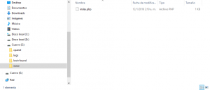
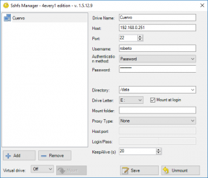

El acceso mediante SSH al servidor es más seguro, rápido y potente. Nos permite trabajar  como si estuviéramos delante del equipo. SFTP no es más que SSH FTP, es decir, permite trabajar con la conexión SSH como si fuera FTP con la ventaja de la encriptación y la transferencia binaria.

Todo sería color de rosa si no fuera porque los clientes de Windows que permiten la conexión mediante SFTP (WinSCP, PSFTP y Filezilla) no son muy dados a compartirla con otros programas como nuestro editor favorito o el Explorador de Archivos.

El mapeo de la conexión SFTP como unidad nos permite solucionar esto para la mayoría de los programas.

 

En la práctica queda funcionando como cualquier otra unidad de disco aunque un poco más lenta para leer.

**How To**

Para poder hacerlo vamos a necesitar dos programas:

- Dokany, librería que simplifica la adaptación de nuevos sistemas de ficheros a Windows. En vez de tener que desarrollar un driver para Windows podemos solucionarlo mediante una API o una DLL. URI: [https://github.com/dokan-dev/dokany](https://github.com/dokan-dev/dokany)

- WinSshFS 4every1 edition, el programa que sen encarga de gestionar nuestras conexiones SFTP y pasarle la información a Dokany para que Windows la muestre de forma amigable. URI: [https://github.com/dimov-cz/win-sshfs](https://github.com/dimov-cz/win-sshfs)

Es importante tener en cuenta que la última versión de WinSshFS fue desarrollada para la versión 0.7.4 de Dokany y no soporta ni funciona con las más nuevas. Además, Dokany 0.7.4, nos requiere tener instalado el Microsoft Visual C++ 2013 Redistributable.

Las instalaciones son sencillas y no requieren más que darle para adelante (Dokany) o extraer algunos archivos (WinSshFS).

Una vez intalado todo, nos dirigimos a la carpeta donde hayamos descomprimido el WinSshFS y arrancamos el programa.

La interfaz es sencilla y bastante intuitiva. Ponemos los datos de la conexión, seleccionamos la letra de unidad donde queremos montar, damos en 'Mount' y deberíamos ver aparecer en nuestro sistema la nueva unidad con nuestros archivos.

> Actualización 1: Dokany para ofrecerte la descarga del redistributable aunque lo tengas instalado.

 

> Actualización 2: Otros dos proyectos interesantes con Dokany [mssqlfs](https://github.com/jimmsta/mssqlfs) y [torrent-mount](https://github.com/mafintosh/torrent-mount)
