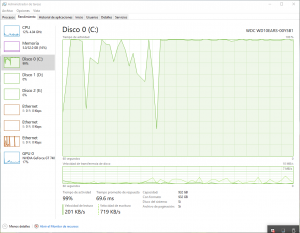

Una de las grandes _features_ que trajo la Anniversary Update de Windows 10 es el [Windows Subsystem for Linux](https://docs.microsoft.com/es-es/windows/wsl/about) (WSL), una _compatibility layer_ que permite correr de forma nativa los ejecutables ELF de Linux. Si bien no está pensado para correr un X Window (aunque hay por ahí circulando guías para poder lograrlo) puede perfectamente ejecutar todas esas herramientas y servicios hoy completamente intrínsecos al desarrollo web como son los _package managers, linters, test suites,_ étc.

Como es de esperarse cuando "virtualizamos" un SO tenemos una caída del rendimiento pero, en principio, los tiempos del WSL dejan mucho que desear. Tareas simples como actualizar un paquete con npm o procesar algunos archivos SASS puede demorar varias veces más de lo habitual, incluso varios minutos.

Con un rápido monitoreo se ve que cuando realizamos tareas en WSL se dispara el uso del procesador y del disco. Uno de los procesos que más sube su uso de los recursos del sistema es el asociado al Antimalware / Defender.  Indagando un poco en Google podemos ver que, como sucede desde la época de Vista, Windows sigue sin llevarse bien con los directorios con muchos archivos pequeños.

La filosofía de Linux de tener cientos de módulos con responsabilidades mínimas sumado al escaneo por parte de Windows de cada uno de estos archivos cuando es accedido o modificado hace que los tiempos se multipliquen.

Por lo visto, de momento la única [solución](https://github.com/Microsoft/WSL/issues/1932) posible es desactivar la protección en tiempo real de Windows Defender. La exclusión de la carpeta de datos y del ejecutable de WSL parece no alcanzar por si sola para mejorar la performance aunque probablemente tenga que ver más con que, al ejecutarse de forma nativa los programas de Linux, se nos estén pasando agregar algunos.

Una vez detenido la protección en tiempo real la performance general mejora drásticamente aunque sin llegar a ser la misma que observamos en Linux. Desde el equipo detrás de WSL [prometen](https://www.reddit.com/r/bashonubuntuonwindows/comments/770ve0/hows_redstone_3_with_small_files/dojtqhd/) estar haciendo lo posible para mejorar estos tiempos pero como el problema es intrínseco al sistema de archivos no es probable que se vayan a ver soluciones definitivas en el corto plazo.
