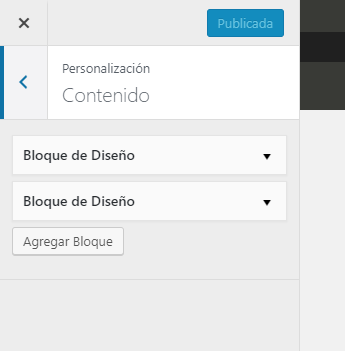

A partir de la versión 4.1 de Wordpress implementó una API en Javascript que permite la creación y el control de todos los elementos del Customizer además del renderizado de controles a partir de plantillas de Underscore.

Estas dos novedades permiten el manejo de los paneles, las secciones y los controles únicamente desde Javascript, abriendo un mundo de posibilidades.

La organización de la API viene dada por el uso de colecciones para agrupar las instancias de los elementos que ya existen y modelos para la creación de nuevos. Las colecciones son:

- wp.customize.control
- wp.customize.panel
- wp.customize.section

En tanto, los modelos son:

- wp.customize.Control
- wp.customize.Panel
- wp.customize.Section

En el caso de los controles existen modelos específicos que extienden a Control y agregan características específicas para cada tipo:

- BackgroundControl
- BackgroundPositionControl
- CodeEditorControl
- CroppedImageControl
- DateTimeControl
- HeaderControl
- ImageControl
- MediaControl
- SiteIconControl
- UploadControl

La utilización de las colecciones y los métodos es bastante intuitiva ya que sigue esquemas conocidos para los que tienen una base de Javascript y similares a los que se utiliza mediante la API PHP de Wordpress.Por ejemplo, 

Pero, antes de meternos de lleno, necesitamos que nuestro código se cargue cuando abramos el Customizer, para ello vamos a usar el hook **customize\_controls\_enqueue\_scripts**:

```
function wp_enqueue_customize_script() {
    wp_enqueue_script( 'wp-customizer', get_template_directory_uri() . '/scripts/customizer/main.js', [], null, true );
}

add_action( 'customize_controls_enqueue_scripts', 'wp_enqueue_customize_script' );
```

## Paneles

Para agregar paneles invocamos el método **add** de la colección **panel** que recibe como parámetro un objeto creado a partir del modelo Panel que, a su vez, recibe los mismos parámetros que **$wp\_customize->add\_panel()**:

```
wp.customize.panel.add(
    new api.Panel( 'wp_nuevo_panel', {
        title: 'Nuevo panel',
        priority: 25
    })
);
```

Lo que agregaría un panel con id _wp\_nuevo\_panel_, título _Nuevo panel_ y prioridad _25_.

A partir de que lo agreguemos podremos acceder al mismo mediante la colección de la siguiente manera:

```
wp.customize.panel('wp_nuevo_panel').sections();
```

Lo que devuelve todas las secciones anidadas en este panel.

```
wp.customize.panel('wp_nuevo_panel').params.title;
```

Que nos permite obtener el título del panel en cuestión.

## Secciones

Las secciones siguen el mismo formato que los paneles:

```
wp.customize.section.add(
    new api.Section( 'wp_nueva_seccion', {
        title: 'Nueva seccion',
        panel: 'wp_nuevo_panel',
        priority: 25,
        customizeAction: 'Personalización'
    })
);
```

Lo único particular que vemos es la opción **customizeAction** que representa el texto que aparece en la parte de arriba del título de la sección y que es necesario definirlo, [por ahora](https://core.trac.wordpress.org/ticket/42635), porque no tiene valor predeterminado.



Al igual que con los paneles, una vez agregada la sección, podemos acceder a la misma a través de la correspondiente colección:

```
wp.customize.sections('wp_nueva_seccion').priority(30);
```

Lo que cambiaría la prioridad asignada al panel cambiando la posición del mismo. O:

```
wp.customize.sections('wp_nueva_seccion').controls();
```

Para obtener la colección de controles que hay en la sección.

## Controles

Llegamos a la parte más interesante del Customize, los controles. Por ahora vamos a ver la interacción desde la API y más adelante, en otro artículo, las potencialidades de las templates de Underscore.

En este caso nos encontraremos con más particularidades que con los otros dos apartados porque los controles, para que sean finalmente almacenados en nuestra BBDD, tienen estar relacionados con una **setting**. Si bien se pueden [agregar settings de forma dinámica](https://wordpress.stackexchange.com/questions/280561/customizer-instantiating-settings-and-controls-via-javascript/280744#280744), por ahora, sigue siendo más sencillo agregarlas desde PHP y utilizarlas desde Javascript.

```
wp.customize.control.add(
    new api.Control( 'wp_nueva_control', {
        label: 'Texto',
        section: 'wp_nueva_seccion',
        setting: wp.customize( 'mi_setting_de_texto' )
    })
);
```

Como vemos, un sencillo control de texto, no nos presenta ninguna dificultad. Lo único nuevo es la forma de pasar la _setting_ y se debe a que **wp.customize** es, a su vez, la colección donde se almacenan las settings.

Pero, por ejemplo, cuando queremos agregar un MediaControl necesitamos especificar además el texto de las etiquetas:

```
wp.customize.control.add(
    new api.MediaControl( 'anred_placemark_image_control', {
        section: 'wp_nueva_seccion',
        label: 'Logo',
        setting: api( 'wp_logo_image' ),
        button_labels: {
            change: 'Cambiar logo',
            default: 'Sin logo',
            frame_button: 'Elegir logo',
            frame_title: 'Elegir logo',
            placeholder: 'Logo no elegido',
            remove: 'Quitar logo',
            select: 'Elegir logo'
        }
    }
)
```

Hasta el momento no encontré ninguna referencia sobre qué parámetros tienen valor por defecto y cuales no para cada control. La fuente última para saberlo es el código de la API que se encuentra en _wp-admin/js/customize-controls.js_ o el código PHP de los controles en la carpeta _wp-includes/customize/_.
